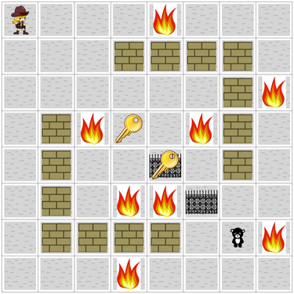

### README
###
# Michael's AI Project
 

# Michael's Output:
### Folder "a__Output_ANOVA" has Michael's ANOVA charts
### Folder "a__Output_Run_Lookahead" has results for Michael's Run_Lookahead run for A* HFF with 16% Fireballs
### Folder "a_Output_BoxPlots" has Michael's box plots
### Folder "a_Output__Charts" has Michael's .png files that shows sets of 10 trial funs for A* HFF (for all levels of fireballs), A* LMCUT (for all levels of fireballs), and Eager Greedy HFF (for all levels of fireballs). Note that if the file has ".saved" as a suffix, this means it is supposed to be a permanent file in the folder.  Otherwise, it may be a temp file from a shorter run.  The output folders below this show some examples of output images for various runs but also have repeats of what is found in the a_Output__Charts folder.
# Michael's Python Programs:
### Michael's programs are found in the pddlgym folder.  Michael wrote 100% of all of these programs.  There are 10 such programs in total.  Each program starts with "MB_".
### The programs are self-explanatory from their title.  MB_Sample.py is used to create the fireball locations for the project.
# Michael's PDDL Domain Script:
#### pddlgym/pddlgym/pddl/doors.pddl
# Michael's PDDL Problem Scripts:
### many scripts in this folder:  pddlgym/pddlgym/pddl/door
# Sample Log:
### A sample log of a run for 10 scripts for 16 percent fireballs for A* Hff is found in the main folder under the file name "sample_log_16Percent_Astar_HFF.
# Michael's contributions to package code:
### Adding Fireballs, Walls and Person to Output Images:  I added this code throughout the doors.py file at pddlgym/pddlgym/rending/doors.py 
### Collecting planning time, search time, nodes evaluated, and nodes expanded:  to do this, I wrote all the code for lines 71-98 of pddlgym/pddlgym/pddlgym planners/pddlgym planners/pddlgym planner.py
### Options for search algorithms and heuristics: I set up some simple search and heuristic options on lines 142-161 of /pddlgym/pddlgym/pddlgym planners/pddlgym planners/FD/driver/aliases.py

  
